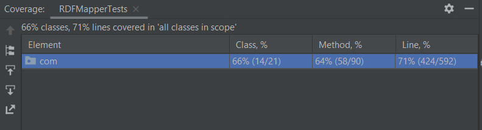

# Első lépések
A házi feladat első lépéseként végig olvastuk a projekt leírását valamint megvizsgáltuk a projekt fájljait és tesztjeit. Mivel ez a projekt sajnos nem rendelkezik UI-al így a példakód kipróbálása mellett döntöttünk.
Mint ahogy a READ.me-ben is szerepel egy egyszerűbb Java Bean osztály segítségével már tesztelhető is lett a program.
Ehhez a Person osztályt használtuk fel és majd késöbb bővítettük a teszteknek megfelelően.

#### A projekt célja
A Pinto egy olyan Java keretrendszer amely egy paraméterül kapott Java Bean osztály, a megfelelő property-jei mentén RDF-re alakítja. Ezt ugyan úgy visszafele is megtudja tenni.

Azaz a paraméterül kapott Person osztály objektuma a következő képpen alakul átt.

Person("Michael Fox") &#8594; <tag:complexible:pinto:f97658c7048377a026111c7806bd7280> <tag:complexible:pinto:name> "Michael Fox"^^<http://www.w3.org/2001/XMLSchema#string>

Láthatóak a megfelelő RDF property-k, a subject, object és a label.

##### Java Bean magyarázat
- A Java Bean egy Java konvenció vagy standard egy osztály létrehozására
- 3 alapvető tulajdonsága van egy ilyen osztálynak
  1. Minden property private &#8594; getter/setterek használata
  2. Van egy publikus üres konstruktora kötelezően
  3. Implementálja a Serializable interfészt

# Elvégzett feladatok és tesztek

## Solar Cloud implementation - Valent Barnabás

- sonarcloud.io weboldal megnyitása, GitHub opció kiválasztása
- A projekt importálása opció kiválasztása
- Megfelelő projekt kiválasztása 
    - BME-MIT-IET
    - csak a kiválasztott repository-k opció alkalmazása
    - saját repository-nk kiválasztása (iet-hf-2022-lorem-ipsum)
        - itt mivel nem volt a hozzáadáshoz jogosultságom, a projekt tulajdonosát kellett megkérnem, hogy hozzáadjam
- Ez után a SonarCloud oldalon az Analysis Method menübe lépve a GitHub Actions opciót választva egy tutorialt végigkövetve adtam hozzá a projekthez
    - Először egy github secretet kellett a projekthez adni
    - Utána a pom.xml fájl kiegészítése a SonarCloud propertijével
    - Végül a build.yaml fájl létrehozása, és a megadott kóddal való feltöltése
- Az analízis módszer beállítása után nem akart tesztelni a program, egy kis kutatás után jöttem rá, hogy a "new code definition" beállítása elmaradt, így, mivel hosszú életű a branch, nem futott le rajta teszt. Itt a new code definíciójának átírása megjavította a problémát, a 30 napnál frissebb kódrészeket fogja tesztelni futtatásokkor
- Mivel a projekt nem tartalmazott hibákat, így nem volt szükséges javítást eszközölni

## Github Action implementálása - Lőrincz Alexandra
- A projekt már eredetileg tartalmazott egy build keretrendszert és teszteket
- Ezeket először lokálisan teszteltem, lefordítottam Gradle-el
- A tesztek és a projekt is sikeresen lefutott
- Ezek után GitHub felületén kezdtem el az Actiont felépíteni
- Beépített funkció segítségével létrehoztam a build.yml file-t (Java with Gradle)
- Ezen belül pedig a megfelelő pontokkal kiegészítettem a workflow-t
- Ilyen volt például a verziókezelés
  - A projekt 2016-ban készült és a gradle verziók sajnos teljesen elmentek egymás mellett, ezt orvosolnom kellett
  - Miután ez megvolt a Java verzión is állítanom kellett, hogy kompatibilis legyen a korábban beállított gradle-el
  - Az újabb verziókkal újabb szintaxisok is jártak, így bele kellett nyúlni a build.gradle-be is ahol a megfelelő kulcsszavakat az új verziónak megfelelőre kellett cserélni (compile, testCompile)
  - Legutolsó lépésként pedig egy elég fájó pontot kellett orvosolni. Http helyett https-t kellett írni a fájlba, és így sikeresen le tudta szedni a megfelelő disztribúciót. (https://github.com/BME-MIT-IET/iet-hf-2022-lorem-ipsum/blob/main/build.gradle#L7)

## Manuális tesztek - Lőrincz Alexandra & Valent Barnabás & Benedek Boldizsár
  
Manuális tesztelésre két megközelítést használtunk. A korábban említett Person Java Bean osztályt, valamint a már meglévő projekten belüli teszteket.

#### Kiválasztott tesztek és azok leírása:
  
##### testMultipleSubjectsNoIdProvided

A teszt célja: annak tesztelése, hogy létrejönnek-e az RDF entitások, ha nincs id mint megkülönböztető jegy megadva

Elvárt kimenet: RDFMappingException: Multiple subjects found, need to specify the identifier of the object to create
Azaz az elvárt kimenetet az, hogy nem lehet létrehozni RDF-es elemeket megkülönböztető mező nélkül.

##### testWriteMap

A teszt célja: Olyan objektum átadása az RDFMappernek amely egy Map-ben tartalmazza az RDF attribútumokat

Elvárt kimenet: A result tartalmazza a megfelelő subject-et, object-et, tag-eket, és label-eket a kapott attribútum Map szerint

##### testConstructFromEmpty

A teszt célja: Annak tesztelése, hogy az RDFMapper működik-e üres konstruktorra is.

Elvárt kimenet: Ha az RDFMapper üres contruktort kap, csak egy Instance-t adjon vissza üresen, a kapott classhoz igazítva

##### testCanIgnoreCardinalityViolation

A teszt célja, hogy kiderüljön, rendeltetésszerűen működik-e a kardinalitás-probléma jelző értékbeállítása. A problémajelző feladata, hogyha egy egy értékű tulajdonság beállításakor két értéket is látunk neki megadva, milyen módon haladjon tovább a program futása. Vagy exception dobása történik, vagy az első érték elfogadása és a többi eldobása egy waning keretében.

A tesztben az első érték elfogadása opció van megadva, ami az adatfájlban a "Clark & Parsia" vagy "Complexible" érték, ezek közül az egyiket várja az assert a helyes lefutáshoz. Mivel nem exceptiont dobunk, ezért helyesen beállítódik az első érték, és sikeresen fut le a teszt.

##### testAnnotationsWithInvalidURI

A teszt célja két RDF modell azonosságának összehasonlítása. Ezt a Models.isomorphic(...) funkcióval végzi el, ami a más privát funkciókat meghívva végigmegy mindkét RDF gráfon, összehasonlítva őket és egyezés esetén igaz értékkel tér vissza, egyébként hamissal.

A teszt során létrehozunk egy BadCompany objektumot, ami nem valid névvel rendelkezik, így effektív az egyetlen elem benne a weboldal lesz. Ezek után létrehozunk egy gráfot, aminek csak egy eleme van, a "/data/bad_company.nt" fájlban megadott weboldal. A két létrehozott modellt összehasonlítjuk, aminek az eredménye igaz lesz, mivel mindketten csak egy weboldal címet tárolnak.

##### testAnnotationsWithInvalidURIFatal

A teszt célja az RDFMapper.builder() függvényében a MappingOptions.IGNORE_INVALID_ANNOTATIONS hamis értéke esetén helyesen működik-e a program. A jelzés hamisra állításával, amennyiben egy invalid annotációt akarnánk megadni az RDF elem létrehozásakor, a program exception dobással jelzi ezt a hibát.

A teszt során létrehozunk egy BadCompany objektumot, ami rendelkezik egy nem valid névvel és egy valid weboldallal. Amikor az RDFMapper builderével létre kívánnánk hozni az objektumot, a hamisra állított jelzés miatt exceptiont kapunk futtatáskor, így sikeres tesztet generálva.

## Coverage teszt - Lőrincz Alexandra

Az IntelliJ programozói környezet segítségével lehetőségünk volt a már meglévő tesztek segítségével egy lefedettség tesztet is futtatni, így a következő eredményeket kaptuk:

Az az a tesztek az osztályok 66%-át, a metódusok 64%-át valamint a sorok 71%-át tesztelik.

## Stresszés limitáció teszt - Benedek Boldizsár
#### Lépések:
- Egyszerűbb Person osztály elkészítése
- Egyszerűbb Car osztály elkészítése
- Egy alap main osztály elkészítése
#### Feladatok:
- Megnézni, hogy különböző bemeneteknél mennyire romlik a performancia ha egyáltalán romlik
- Limitációk tesztelése
#### Eredmény:
- Üres konstuktornál egy üres Graph -et kaptam vissza nem pedig egy nullt, ez pedig kicsit félrevezető lehet
- Performanicabeli romlás az egy egy új apraméterenként kb. 10% volt, 1 millió iterációnál az 1 paraméteres teszt 3000ms -ig futott, 2 -nél már 3300ms
- Performanciabeli romlás egymásba ágyazott objektumoknál viszont már jelentősebb, 3500ms- ről 5600ms -re ugrott, egy egyszerűbb Car osztály hozzáadásától is
   - Több egymásba ágyazott objektumnál ez hamar összeadódhat!
#### Mérések:
0 paraméter: 2687
1 paraméter: 2931
2 paraméter: 3256
3 paraméter: 3581
3 paraméter + objektum 1 paraméterrel: 5536
3 paraméter + objektum 2 paraméterrel: 5431
3 paraméter + objektum 3 paraméterrel: 5500

## Unit Test implementálása - Péter Noémi Zsuzsanna

- Unit tesztekkel való ismerkedés, előadás és gyakorlat átnézése.
- Először a verziók beállításával kellett foglalkoznom.
- Gradle megjavítása. Projekt futtatható állapotba való állítása.
- Kód értelmezése.
- Jacoco megismerése és kipróbálása
    - Sikertelen üzembehelyezés.
- IntelliJ Code Coverage használata
    - kezdeti elért lefedettség megvizsgálása
- Unit tesztek készítése az RDFMapperTests.java fájlba:

Végső kódlefedettség:

  - RDFMapper.java osztályban levő függvények tesztelése
      - kódlefedettség növelése method szempontból: 86% --> 91%
  - SourcedObjectImpl.java osztályban levő függvények tesztelése
      - kódlefedettség növelése method szempontból: 50% --> 75%
  - Mockolás megismerése, kipróbálása - sikertelen.
- Dokumentáció elkészítése
